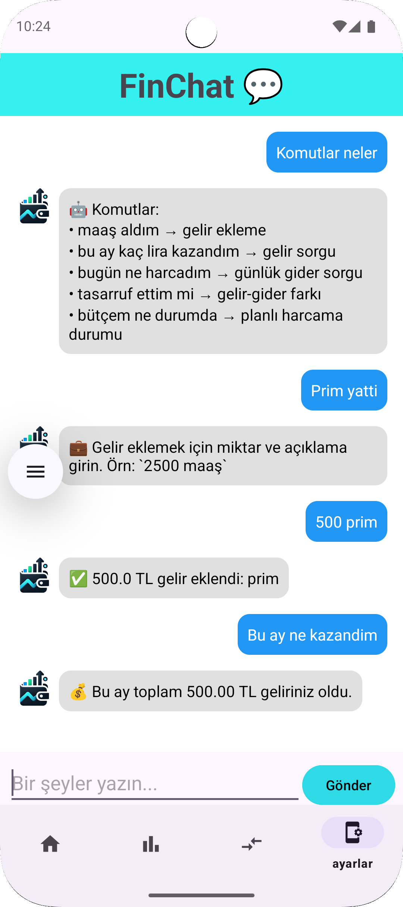

# Finsight 📊

**Finsight**, kişisel finanslarınızı kolayca yönetmenizi sağlayan bir Android uygulamasıdır.  
Gelir-gider takibi yapabilir, varlıklarınızı görebilir, grafiklerle analiz edebilir ve akıllı sohbet botuyla doğal dilde etkileşim kurabilir.

---

## 🚀 Özellikler
- 📊 **Gelir ve gider takibi:** Manuel veri girişi ve aylık filtreleme
- 📈 **Grafik raporlar:** Haftalık, aylık ve yıllık analizler
- 💬 **Yapay zekâ destekli sohbet botu:**
  - Gelir/gider sorgulama
  - Gelir ekleme
  - Tasarruf hesaplama
  - Bütçe durumu raporlama
- 🧠 **Makine öğrenmesi modeli:** TensorFlow Lite ile entegre edilmiş niyet sınıflandırıcı (IntentClassifier)
- 🗂️ SQLite/Room DB tabanlı veri yönetimi

---

## 📸 Ekran Görüntüleri

  

---

## 🛠️ Teknolojiler
- Kotlin
- Android Jetpack
- Room (v1.0)
- Firebase (v2.0’de geçilecek)
- TensorFlow Lite (ML destekli chatbot)

---

## 📌 Sürüm
**v1.0** – Room veritabanı ile ilk sürüm yayında!

---

## 🧑‍💻 Geliştirici
Arslan Karaca  
(https://github.com/arsaca3)
